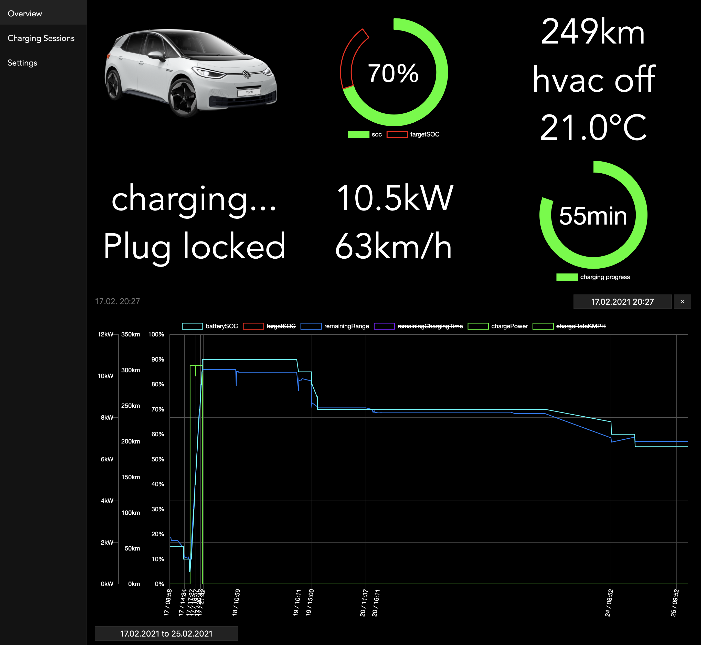

# ID DataLogger

Welcome to the ID DataLogger project.
This programm allows you to log data about your Volkswagen ID vehicle.
It includes an iOS widget (using Scriptable) and a webpage for seeing current status and history graphs.

  
  

## Setup

### Setup for beginners

A quick heads-up beforehand: Setting this up for someone who has never set up a webserver before can be challenging.
Don't worry though, the [beginners guide](docs/beginnerguide.md) tries to help you as much as possible and guides you through every step.

### Setup for advanced users

Prerequisites are:
- PHP 8 cli with pgsql (or mysql), curl, gd and dom
- A webserver serving .php files (PHP 8 with pgsql (or mysql))
- (strongly recommended) HTTPS enabled server with certificate
- A postgresql server (Any version from 9 and up should work, although testing has only been done on 11 and up)
    - alternatively mysql / mariadb is supported (alternative db servers may also work)

Clone this project.

`git clone https://github.com/robske110/IDDataLogger.git --recursive`

Create a database (and a user) in your postgresql server for this project and fill in the details into config/config.example.json and .env.example. We'll need these files later.
You can alternatively use the config setup wizard by running the `config-wizard.sh` script.
Note: for a detailed description of the possible config values visit [config.md](docs/config.md).

After creating the config.json from config.example.json run `./start.sh`.
After a successful connection the the db the setup wizard will help you create an API key for the widget and a user for the website.

All files in the `public` directory of this repository must now be placed somewhere in the webroot.
It is recommended to place them in the second level (not directly in webroot).

Then copy the `.env.example` file as `.env` outside the webroot with the db credentials set in it.

Note:
`env.php` looks for a `.env` file two folders up from its location.
(If you put the contents of the public folder in `/path/to/webroot/vwid/` it will look in `/path/to/.env`)
If you place the files deeper inside the webroot, please consider editing env.php and configuring the correct path in the first line. It is strongly recommended keeping the .env file out of the webroot.

You can alternatively set the environment variables through your webserver. (Or anything else that populates php's `$_ENV`)

After successful start you can now visit idView.php or use the iOS widget after [setting it up](docs/ioswidget.md)!

## Disclaimer

This project is not endorsed by Volkswagen in any way, shape or form. This project is to be used entirely at your own risk.
All brands and trademarks belong to their respective owners.

Copyright (C) 2021 robske_110

This program is free software: you can redistribute it and/or modify
it under the terms of the GNU General Public License as published by
the Free Software Foundation, either version 3 of the License, or
(at your option) any later version.

This program is distributed in the hope that it will be useful,
but WITHOUT ANY WARRANTY; without even the implied warranty of
MERCHANTABILITY or FITNESS FOR A PARTICULAR PURPOSE.  See the
GNU General Public License for more details.